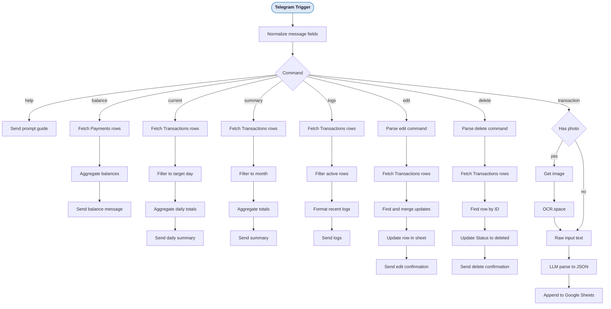

<div align="center">

# n8n Expense Tracker

### Telegram — OCR / LLM — Google Sheets

<p>
  
  
  
  
  
</p>

<p>
  An event-driven personal finance tracker built with <strong>n8n</strong>.<br/>
  Log expenses and income via <strong>Telegram</strong> — text or receipt photo —<br/>
  extract structured data using <strong>OCR + LLM</strong>, store everything in <strong>Google Sheets</strong>,<br/>
  and receive automated <strong>daily, weekly, and monthly summaries</strong> on demand.
</p>

<p>
  <a href="#overview">Overview</a> &nbsp;|&nbsp;
  <a href="#features">Features</a> &nbsp;|&nbsp;
  <a href="#architecture">Architecture</a> &nbsp;|&nbsp;
  <a href="#data-model">Data Model</a> &nbsp;|&nbsp;
  <a href="#commands">Commands</a> &nbsp;|&nbsp;
  <a href="#setup">Setup</a>
</p>

</div>

<br/>

## Overview

This project automates personal finance tracking through a Telegram bot backed by an n8n workflow. Instead of manually entering transactions, you send a message or a photo of a receipt — the system does the rest.

| Step | What Happens |
|:---:|---|
| **Capture** | Send a message or receipt photo to your Telegram bot |
| **Extract** | OCR reads text from photos; plain messages are used directly |
| **Parse** | An LLM converts raw text into a strict JSON transaction schema |
| **Store** | A normalized row is appended to the Google Sheets `Transactions` tab |
| **Report** | On-demand and scheduled summaries delivered back via Telegram |

> [!NOTE]
> All LLM parsing uses a **strict JSON schema** to prevent hallucinated or malformed fields. Transactions are **never physically deleted** — a soft-delete strategy preserves data integrity and audit trails.

<br/>

## Features

### Logging

- Expense and income capture via Telegram message
- Receipt photo parsing — photo → OCR → structured entry
- Strict JSON extraction with no hallucinated fields

### Storage

- Google Sheets ledger with append-only writes and status tracking
- Soft delete — transactions marked `deleted` are excluded from all reports
- Balance Logs sheet for periodic snapshots

### Reporting

| Command | Output |
|---|---|
| `/balance` | Current balance across all accounts |
| `/summary` | Monthly income and expense breakdown |
| `/current` | Daily summary for today |
| `/current YYYY-MM-DD` | Daily summary for a specific date |

### Transaction Management

| Command | Description |
|---|---|
| `/logs` | View recent active transactions |
| `/logs 10` | View last N transactions |
| `/edit <ID> field=value` | Update a specific field on a transaction |
| `/delete <ID>` | Soft-delete a transaction by ID |

<br/>

## Architecture



<br/>

## Data Model

Three sheets power the tracker:

### `Transactions`

| Column | Description |
|---|---|
| <kbd>ID</kbd> | Auto-generated identifier, e.g. `TX-001` |
| <kbd>Date</kbd> | ISO timestamp |
| <kbd>Type</kbd> | `expense` or `income` |
| <kbd>Category</kbd> | Transaction category |
| <kbd>Description</kbd> | Free-text description |
| <kbd>Amount</kbd> | Numeric value |
| <kbd>Source</kbd> | Payment source or account |
| <kbd>Status</kbd> | `active` or `deleted` |

### `Payments`

Used for `/balance` computation across accounts.

### `Balance Logs`

Stores periodic balance snapshots — <kbd>Date</kbd> and <kbd>Total Balance</kbd>.

### Soft Delete Strategy

> [!IMPORTANT]
> Transactions are **never physically removed**. Setting `Status = deleted` excludes a row from all logs and summaries while preserving the record for audit and recovery purposes.

| Status | Behavior |
|:---:|---|
| `active` | Included in all reports and logs |
| `deleted` | Excluded from all reports; recoverable |

<br/>

## Commands

### Quick Reference

```
/start or /help        — Send the prompt guide
/balance               — Current balance
/summary               — Monthly summary
/current               — Today's daily summary
/current YYYY-MM-DD    — Summary for a specific date
/logs                  — Recent active transactions
/logs 10               — Last N transactions
```

### Logging a Transaction

```
Add expense
  Amount:
  Description:
  Mode of Payment:

Add income
  Amount:
  Description:
  Source Account:
```

### Editing a Transaction

```bash
/edit TX-006 amount=15
/edit TX-006 description="tric to PUP"
/edit TX-006 category=transportation amount=20
```

### Deleting a Transaction

```bash
/delete TX-006
```

<br/>

## Setup

### Prerequisites

<kbd>Docker</kbd> &nbsp; <kbd>Telegram Bot Token</kbd> &nbsp; <kbd>Google Sheets Credentials</kbd> &nbsp; <kbd>LLM API Key</kbd> &nbsp; <kbd>OCR.space API Key</kbd>

> [!IMPORTANT]
> Always use environment variables or n8n credentials for secrets. Never hardcode API keys.

### Local Development

**1. Create `.env`**

```env
N8N_ENCRYPTION_KEY=CHANGE_ME
WEBHOOK_URL=http://localhost:5678

OPENROUTER_API_KEY=REPLACE_ME
Telegram_Id=REPLACE_ME
OCRSPACE_API_KEY=REPLACE_ME
```

**2. Start the container**

```bash
docker compose up -d
```

**3. Import the workflow**

- Open the n8n UI
- Import the workflow JSON
- Configure credentials for Telegram, Google Sheets, LLM, and OCR

### Deployment

<details>
<summary><strong>Click to expand — Azure Container Apps</strong></summary>

The tracker is designed for deployment on **Azure Container Apps**:

- n8n container with persistent storage
- Secret management via Azure Key Vault or environment variables
- Webhook URL pointed to the public container endpoint

</details>

<br/>

## Design Decisions

| Decision | Rationale |
|---|---|
| **Google Sheets as storage** | Simplicity, transparency, and no database setup required |
| **Soft delete** | Maintains stable IDs and prevents accidental data loss |
| **Telegram as interface** | Lightweight command interface accessible from any device |
| **Strict JSON output from LLM** | Prevents hallucinated fields and ensures schema reliability |
| **OCR.space for receipts** | No local model required; works within n8n HTTP request nodes |

<br/>

---

<div align="center">
  <sub>
    Built with n8n, Telegram, Google Sheets, and OCR.space &nbsp;&bull;&nbsp; Containerized with Docker
  </sub>
</div>
