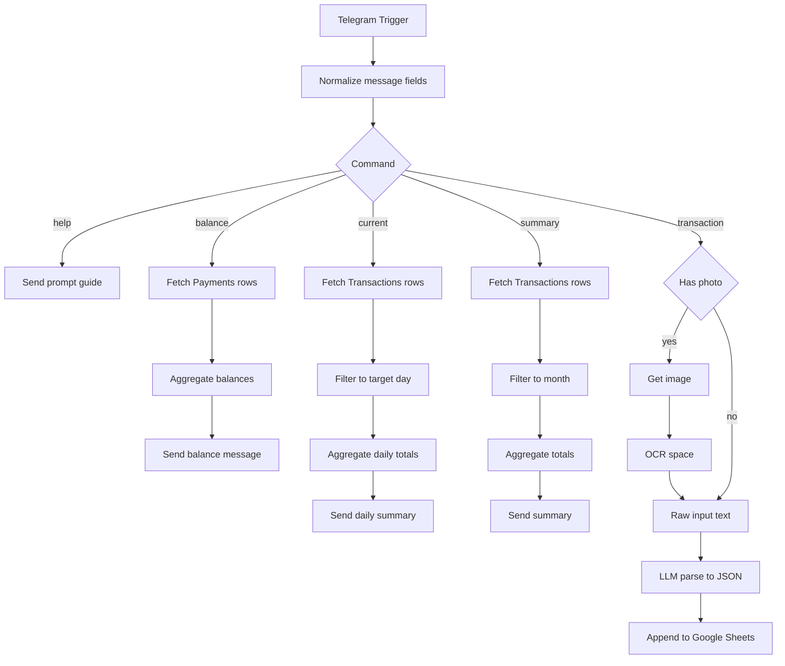

# n8n Expense Tracker (Telegram → OCR/LLM → Google Sheets)

An event-driven personal finance tracker built with **n8n**. Log expenses/income via **Telegram** (text or receipt photo), extract structured transaction data using **OCR + LLM**, store everything in **Google Sheets**, and receive automated **daily / weekly / monthly summaries** plus **current balance** on demand.

## What the Expense Tracker does

### Core workflow
1. **Capture**: Send a message or receipt photo to your Telegram bot.
2. **Extract**:
   - If photo: OCR extracts text (OCR.space).
   - If text: uses your message directly.
3. **Parse**: An LLM (OpenRouter) converts the raw text into a strict JSON transaction schema.
4. **Store**: Appends a normalized row to Google Sheets (`Transactions` tab).
5. **Report**:
   - On-demand: `/summary`, `/current`, `/balance`
   - Scheduled: weekly report (Schedule Trigger), monthly report (Schedule Trigger on day 28)
   - Optional: daily balance logging to `Balance Logs`

This repo is designed to showcase an end-to-end "delivery mindset": automation design, parsing reliability, data modeling, reporting, and deployment readiness.

---

## Features

### Logging
- **Expense/Income capture** via Telegram
- **Receipt parsing** (photo → OCR → structured entry)
- **LLM extraction** with strict JSON-only output (no hallucinated fields)

### Storage
- **Google Sheets ledger** (append-only transaction logging)

### Commands (Telegram)
- **Help / guide**: `/start` or `/help`
- **Monthly summary**: `/summary`
- **Daily summary**: `/current` or `/current YYYY-MM-DD`
- **Current balance**: `/balance`

### Reports
- **Daily summary**: totals + category breakdown for a day
- **Weekly automated report**: needs vs wants, income vs expense, plus balance breakdown
- **Monthly automated report**: same, computed for the 28th→28th window
- **Balance logs**: scheduled writes to a `Balance Logs` sheet for trend tracking

---

## Architecture



---

## Data model (Google Sheets)

### Transactions columns

The workflow appends the following fields:

- `Date` (ISO timestamp)
- `Type` (`expense` or `income`)
- `Category`
- `Description`
- `Amount`
- `Source` (payment method or source account)

### Payments sheet

Used for the `/balance` computation (grouping by `Source` and summing `Amount`).

### Balance Logs sheet

Stores periodic snapshots:
- `Date`
- `Total Balance`

---

## Setup

### Prerequisites

- Docker (recommended)
- Telegram Bot (token configured in n8n credentials)
- Google Sheets credentials (service account recommended)
- OpenRouter API key
- OCR.space API key (if using receipt photos)

> ⚠️ Don't hardcode secrets in the workflow JSON. Use environment variables and/or n8n Credentials.

### Local development (Docker)

#### 1) Create `.env`

Use an `.env.example` pattern like:

```env
N8N_ENCRYPTION_KEY=CHANGE_ME_LONG_RANDOM_STRING
WEBHOOK_URL=http://localhost:5678

OPENROUTER_API_KEY=sk-or-v1-REPLACE_ME
Telegram_Id=REPLACE_ME
OCRSPACE_API_KEY=REPLACE_ME
```

#### 2) Run n8n
```bash
docker compose up -d
```

#### 3) Import the workflow

1. Open n8n UI
2. Import the workflow JSON (from this repo)
3. Configure n8n Credentials:
   - Telegram API
   - Google Sheets API

> Note: Telegram triggers require a public HTTPS URL to receive updates. For local testing, use ngrok/cloudflared.

---

## Deployment (Azure, Terraform-first)

This project is designed to be deployable using **Azure Container Apps**:

- Run `n8nio/n8n` container with HTTPS ingress
- Persist `/home/node/.n8n` using Azure Files
- Inject secrets via Container Apps secrets (or Key Vault)

Terraform lives in:
```
infra/terraform/
```

Typical flow:
```bash
terraform init
terraform plan
terraform apply
```

After deployment:
- Set `WEBHOOK_URL` to the Azure Container App public URL
- Activate the Telegram Trigger so it registers the webhook correctly

---

## Security notes

- Rotate keys immediately if they were ever committed.
- Use environment variables or managed secrets (recommended).
- Treat chat IDs and sheet IDs as "low sensitivity", but keep tokens/API keys secret.

---

## Roadmap / Improvements

- Replace Google Sheets with Postgres for stronger guarantees and querying
- Add validation + retry logic for OCR/LLM failures
- Add "confidence" flags for ambiguous parses
- Add observability: error notifications to Telegram + structured logs
- Add CI checks (formatting, secret scanning)

---

## Quick demo commands

`/help` → shows prompt template

Send **expense**:
```
Amount:
Description:
Mode of Payment:
```

Send **income**:
```
Amount:
Description:
Source Account:
```

`/summary` → monthly summary

`/current` or `/current YYYY-MM-DD` → daily summary

`/balance` → current balance by source
